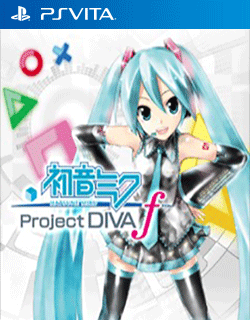

# Hatsune Miku: Project DIVA f

## PS Vita Saves - PCSE00326

| Icon | Filename | Description |
|------|----------|-------------|
|  | [00000001.zip](00000001.zip){: .btn .btn-purple } | An updated version of the guy who commented &#34;All songs on all difficulties completed to the stage of perfect, open all the images, all purchased.&#34;  Fixed to prevent file is corrupt error an C2-14780-0 error. Should be easy for you to use with d3m3vilurr&#39;s save manager.  - Vanilla  |
|  | [00000002.zip](00000002.zip){: .btn .btn-purple } | This is my personal save file of Project Diva F, it has all the songs of the base game and of the DLC unlocked even on Extreme. There are also many costumes I have bought for various vocaloids and some points that you can spend yourself!  Enjoy!  Uploader: Aurora of Wololo   |
|  | [00000003.zip](00000003.zip){: .btn .btn-purple } | All songs on all difficulties completed to the stage of perfect, open all the images, all purchased.  |
