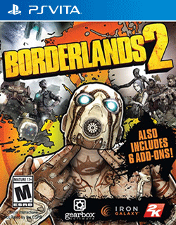

# Borderlands® 2

## PS Vita Saves - PCSE00383

| Icon | Filename | Description |
|------|----------|-------------|
|  | [00000001.zip](00000001.zip){: .btn .btn-purple } | ALL Characters lvl 50  backed up using vita save manager works on any account ( restore using vita save manager )  |
|  | [00000002.zip](00000002.zip){: .btn .btn-purple } | Full 50 lvl(no dls) + legendary wapons, 4 persons (Axton, Maya, Salvador, Zero)  |
|  | [00000003.zip](00000003.zip){: .btn .btn-purple } | story mode finished, gunzeker class.  |
