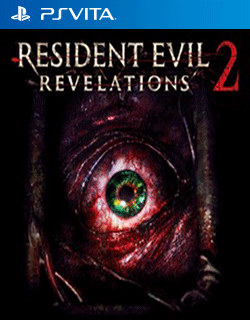

# Resident Evil® Revelations 2

## PS Vita Saves - PCSE00608

| Icon | Filename | Description |
|------|----------|-------------|
|  | [00000001.zip](00000001.zip){: .btn .btn-purple } | Story mode finished 100% all at row S including all medallions, insect larvae and kafka designs included.  Regarding the raid mode all the characters are at level 100.  The skills of Claire, Moira and Barry have been improved to the maximum except the other characters.  All internships are unlocked and completed even those of the red code with most has 3 medals.  -Alex Wesker defeated even in red code  -Enjoy!  |
|  | [00000002.zip](00000002.zip){: .btn .btn-purple } | This backup contains patches and improvements Adding the stopwatch and invisible mode 100% complete at rank S Addition of the -Fusarbalète -Infinite Rocket Launcher -Meat grinder -Infinite Munitions -Bubble gun -Katana -Glaive  |
|  | [00000003.zip](00000003.zip){: .btn .btn-purple } | full game finished all weapons please add more weapons if you can.  |
|  | [00000004.zip](00000004.zip){: .btn .btn-purple } | full game finished all weapons please add more weapons if you can. (REUPLOAD) bugs fixed  |
