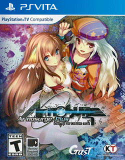

# Ar nosurge Plus: Ode to an Unborn Star

## PS Vita Saves - PCSE00707

| Icon | Filename | Description |
|------|----------|-------------|
|  | [00000001.zip](00000001.zip){: .btn .btn-purple } | Here is an Ar nosurge Plus US save that has the Sekailink elements added to it:   In other words, it adds the following:  You get several plugins from the start that can't be gotten anywhere else. Ion gets three more costumes from her Ciel nosurge clothes selection. Several conversations in the Ion/Earthes side change to reflect that you know about Ciel nosurge's events, explaining some things that were left up in the air in Ciel and in a normal Ar nosurge playthrough. It also shows the relationship status with Ion at the end of Ciel (married in the save file I put up).  |
