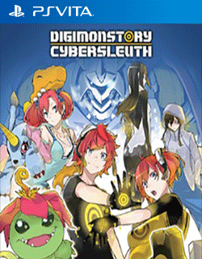

# DIGIMON STORY CYBER SLEUTH

## PS Vita Saves - PCSE00755

| Icon | Filename | Description |
|------|----------|-------------|
|  | [00000001.zip](00000001.zip){: .btn .btn-purple } |  Completed game N+ available (N+ means all digimon and currency is transferred to new game)   |
