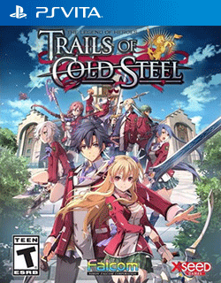

# The Legend of Heroes: Trails of Cold Steel

## PS Vita Saves - PCSE00786

| Icon | Filename | Description |
|------|----------|-------------|
|  | [00000001.zip](00000001.zip){: .btn .btn-purple } | This is my 2nd clear 100% save from the first game. Exported with 0.7 save manager and saves from a legit digital copy.  There's a bunch of junk saves in there you can just ignore. Fie was also chosen as the dance partner at the end. Personally idk if exported saves work, but feel free to try and let me know if it works.  |
|  | [00000002.zip](00000002.zip){: .btn .btn-purple } | here are save data plus clear save (hard mode) note:this is from an update game version (as of may 2018)   |
