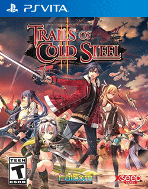

# The Legend of Heroes: Trails of Cold Steel II

## PS Vita Saves - PCSE00896

| Icon | Filename | Description |
|------|----------|-------------|
|  | [00000001.zip](00000001.zip){: .btn .btn-purple } | I'm glad you think so too! Here you go, clean slate hardmode, with my 100% save from the first game carried over, after the first cutscene. I left my system data and clear data there just in case though.  |
|  | [00000002.zip](00000002.zip){: .btn .btn-purple } | Clear Save Data (Normal Difficulty)  |
