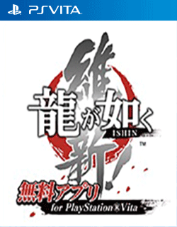

# Ryu ga Gotoku: Ishin!

## PS Vita Saves - PCSG00275

| Icon | Filename | Description |
|------|----------|-------------|
|  | [00000001.zip](00000001.zip){: .btn .btn-purple } | Fully unlocked style grids and mostly unlocked battle dungeon missions (i couldn&#39;t find the unlocks for a few missions so i apologize).  I recommend looking up ishin guides online for a few dungeon missions since some missions need specific decks of the same color in order to play them.  |
|  | [00000002.zip](00000002.zip){: .btn .btn-purple } | All styles unlocked and limit broken, Character level limit broken,All final versions of weapons + enchanted, Golden gun and sword, Amon Sword, 99 of all hammers, All battle dungeon stages unlocked, All the pets in &#34;Another Life&#34;, All soldier cards from friendships and substories  |
